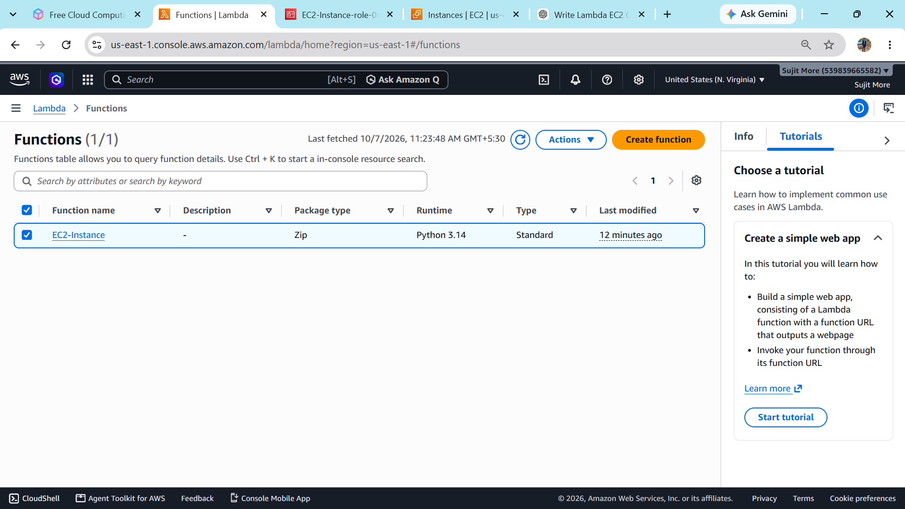
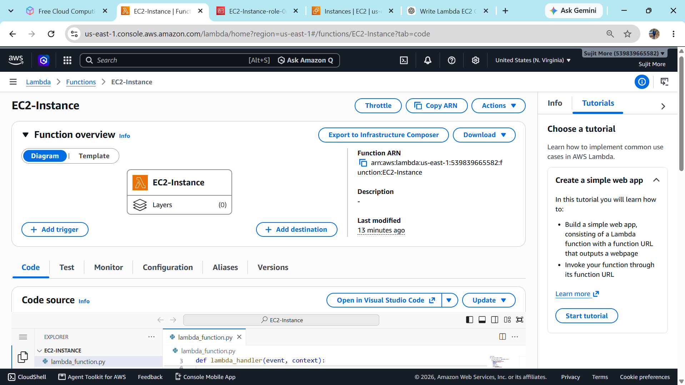
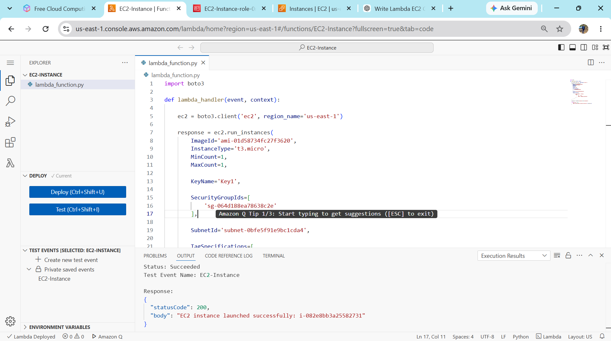
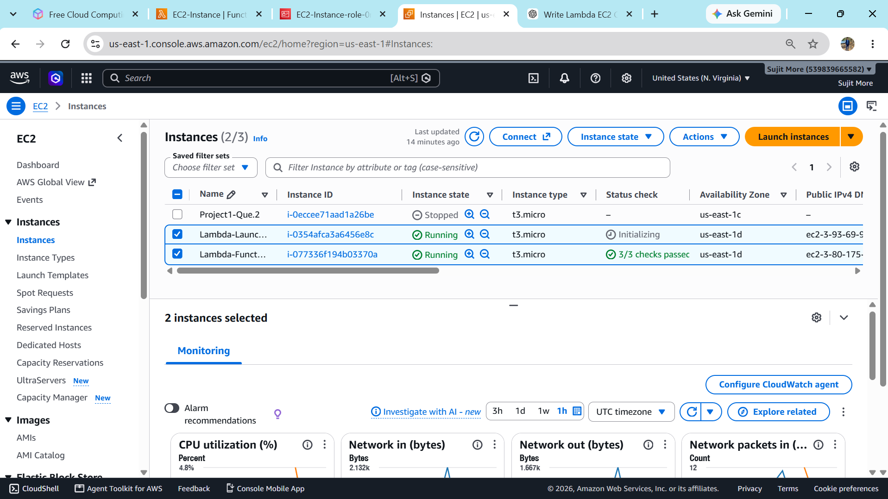
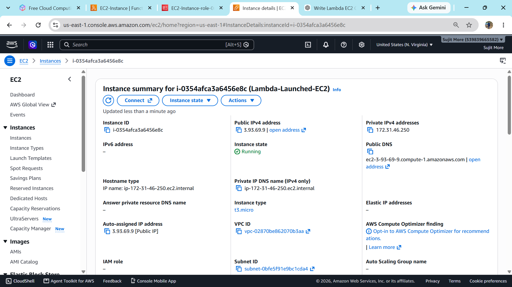

# AWS Lambda – Automatic EC2 Instance Launch

## 📌 Practical Overview

This project demonstrates how to **automatically launch an Amazon EC2 instance using an AWS Lambda function**.

The Lambda function uses the **AWS SDK for Python (`boto3`)** to call the Amazon EC2 `RunInstances` API.  
The configuration shown in the screenshots launches a **`t3.micro` EC2 instance in the `us-east-1` (N. Virginia) region**.

### Architecture

```text
                    ┌──────────────────────┐
                    │      AWS Lambda      │
                    │    Python + boto3    │
                    └──────────┬───────────┘
                               │
                               │ EC2 RunInstances API
                               ▼
                    ┌──────────────────────┐
                    │       Amazon EC2     │
                    │     t3.micro         │
                    │   Instance launched  │
                    └──────────────────────┘
```

---

## 🛠️ AWS Services Used

- **AWS Lambda** – Runs the Python automation code.
- **Amazon EC2** – Virtual server launched by Lambda.
- **IAM** – Provides Lambda permission to launch EC2 instances.
- **Amazon VPC** – Supplies the subnet and networking configuration.
- **Security Group** – Controls network access to the EC2 instance.
- **Boto3** – AWS SDK used by the Lambda Python code.

---

## ⚙️ Configuration Used

| Setting | Value |
|---|---|
| AWS Region | `us-east-1` (N. Virginia) |
| Runtime | Python |
| EC2 Instance Type | `t3.micro` |
| Minimum Count | `1` |
| Maximum Count | `1` |
| Key Pair | `Key1` |
| AMI | `ami-01d58734fc27f3620` |
| Lambda Function | `EC2-Instance` |

> **Note:** AMI IDs, subnet IDs, security-group IDs and key-pair names are region/account specific. Replace them with values from your own AWS account when reproducing the project.

---

# 🚀 Implementation Steps

## 1. Create the Lambda Function

Create a Lambda function named **`EC2-Instance`** using a Python runtime.

The screenshot below shows the Lambda function created successfully.



---

## 2. Configure the Lambda Function

Open the Lambda function and go to the **Function overview** / **Code** section.

The function is configured to execute Python code that communicates with Amazon EC2.



---

## 3. Add the Python Code

The Lambda function uses `boto3` to create an EC2 client and launch one EC2 instance.

### Example Code

```python
import boto3

def lambda_handler(event, context):

    ec2 = boto3.client('ec2', region_name='us-east-1')

    response = ec2.run_instances(
        ImageId='ami-01d58734fc27f3620',
        InstanceType='t3.micro',
        MinCount=1,
        MaxCount=1,

        KeyName='Key1',

        SecurityGroupIds=[
            'sg-064d188ea78638c2e'
        ],

        SubnetId='subnet-0bfe5f91e9bc1cda4',

        # Additional tag configuration can be added here
        # using TagSpecifications.
    )

    instance_id = response['Instances'][0]['InstanceId']

    return {
        'statusCode': 200,
        'body': f'EC2 instance launched successfully: {instance_id}'
    }
```

> **Important:** The AMI, security-group, subnet and key-pair values in this example come from the demonstrated AWS environment. For your own account, use resources that exist in the same region.

---

## 4. Test the Lambda Function

Create or use a Lambda test event and execute the function.

The execution result in the screenshot shows:

- **Status:** Succeeded
- **HTTP status code:** `200`
- An EC2 instance ID was returned.



---

## 5. Verify the EC2 Instance

After successful Lambda execution, open **Amazon EC2 → Instances**.

The instance list shows the newly launched instance with instance type **`t3.micro`** and a **Running** state.



Open the instance details to verify its configuration.



---

# 🔄 Project Workflow

```text
1. Create Lambda Function
          │
          ▼
2. Configure IAM Permissions
          │
          ▼
3. Add Python + Boto3 Code
          │
          ▼
4. Execute Lambda Test Event
          │
          ▼
5. Lambda calls EC2 RunInstances API
          │
          ▼
6. EC2 instance is created
          │
          ▼
7. Verify instance in EC2 Console
```

---

# 🔐 IAM Permission Requirement

The Lambda execution role must have permission to launch EC2 instances.

For a lab/demo environment, the role needs permissions covering the EC2 actions used by the function, such as:

```text
ec2:amazonEC2FullAccess
```

Depending on the configuration and resources used, additional permissions may be required.

### Security Recommendation

For production environments, avoid giving the Lambda role broad administrator permissions such as:

```text
AdministratorAccess
```

Instead, create a least-privilege IAM policy containing only the required actions and resource permissions.

---

# 📂 Practical-Structure

```text
AWS-Lambda-EC2-Practical/
│
├── README.md
│
└── screenshots/
   ├── Function-Created.png
   ├── Function-overview.png
   ├── Code-and-Execution.png
   ├── EC2-2.png    
   └── EC2-1.png
```

---

# ✅ Result

The project successfully demonstrates:

- Creating an AWS Lambda function.
- Using Python and `boto3`.
- Calling the EC2 `RunInstances` API.
- Launching a `t3.micro` EC2 instance automatically.
- Testing the Lambda function.
- Verifying the launched EC2 instance from the AWS Console.

---

## 📸 Screenshots

### Lambda Function Created


### Lambda Function Overview


### Code & Execution Result


### EC2 Instance Launched


### EC2 Instance Details


---

## 🧑‍💻 Author

**Sujit More**

AWS and Devops engineer

---

## ⭐ Key Learning

> This project shows how AWS Lambda can be used for **serverless infrastructure automation**, allowing an EC2 instance to be created programmatically without manually launching it from the EC2 console.
